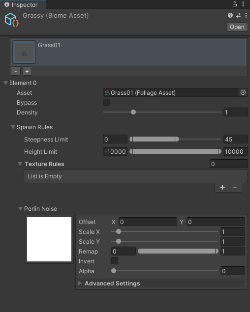
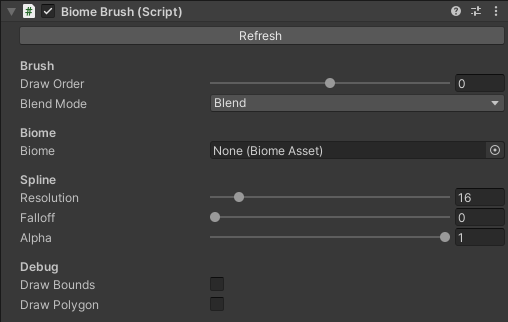

# Getting Started with FoliageTool

This document assumes: 
- You have a basic understanding of Unity's interface.
- You've already [installed FoliageTool](Installing.md) into your Unity project.
- The assets for your foliage are imported and ready to be used in Unity.

### 1. Create your first Foliage Asset
FoliageTool allows you to store foliage configurations as a `FoliageAsset`.

1. Create a new asset by going to `Assets > Create > FoliageTool > Foliage`
2. Set the `Prefab` field to your foliage's prefab.
3. All of the other fields are optional, but provide more customization.

> **Note**: `FoliageAsset` is a wrapper for Unity's Terrain `DetailPrototype`, which holds all the necessary properties for the terrain to automatically spawn your foliage

### 2. Create your first Biome Asset
1. Create a new biome by going to `Assets > Create > FoliageTool > Biome`
2. Add new foliage to the biome by clicking `+`
3. Click on the new element that was created. You will see all the rules for this given foliage asset.
4. Drag the foliage asset you created earlier into the `Asset` field.
5. Configure any relevant properties for your foliage.

> **Note**: `BiomeAsset` is a procedural rule-set for all the foliage in a biome.

### 3. Add FoliageTool to your Terrain
1. Add the `FoliageTerrain` component to your Terrain's GameObject.
2. Assign the biome you created to the `Biome` field.
3. Click `Refresh` and wait for FoliageTool to evaluate your terrain.
4. After it's done, you should see your foliage on the terrain.

---

## Getting Started with Biome Brushes

### 1. Creating a Biome Brush
1. Using another foliage asset, create another biome.
2. Create a biome brush object: `GameObject > Foliage > Biome Brush > Circle`
3. A biome brush GameObject should be created in front of your camera.

In the Inspector, you should see the Biome Brush component.
This is what it should look like:

